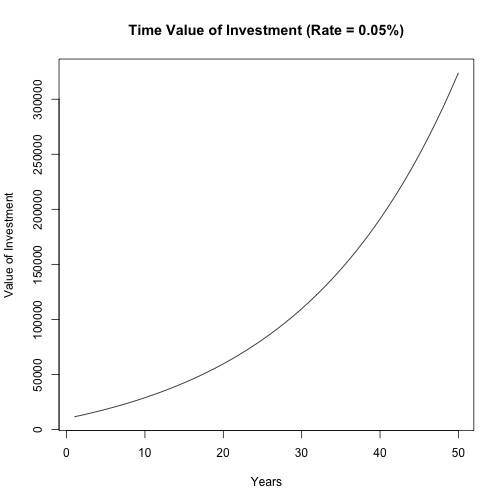

# What is the ROI Calculator?

- Preparing for your financial future requires understanding your goals
and then predicting
how your investments will meet those goals.

- This simple calculator lets you alter 4 inputs
and then projects into the future
to see how those inputs will influence the results.

- This is a simple tool. More complex models are available
that allow more customization.

---

# Why is this important?

- Everyone needs to take greater responsibility for their
financial well being in their later years. Several factors influence
how much your investments grow and how much you put in versus what you get out.

- Since money in an investment is compounded, the longer your money has to grow, the more you will have when you need it. Start investing early.

- Greater rate of return leads to a larger pile at the end, but as rate of return increases, so does risk. General rule is to take more risk early and reduce as you get closer to needing to use the investment.

- Web based tool can be found at: https://wdsteck.shinyapps.io/FutureValue/

---

# ROI Calculator Inputs:

The ROI Calculator takes 4 inputs:

- Initial Investment Amount
- Expected Rate of Return
- Number of Years of Investment
- Annual Contributions Each Year of Investment

Generated is the value of the investment after the period and the
percentage generated from growth versus contributions. Also, a plot of that investment scenario over 50 years is shown.

---

# ROI Calculator Output

Displayed is the percentage of the final value that was generated from the return on investment (as opposed to contributed) and a plot like:

